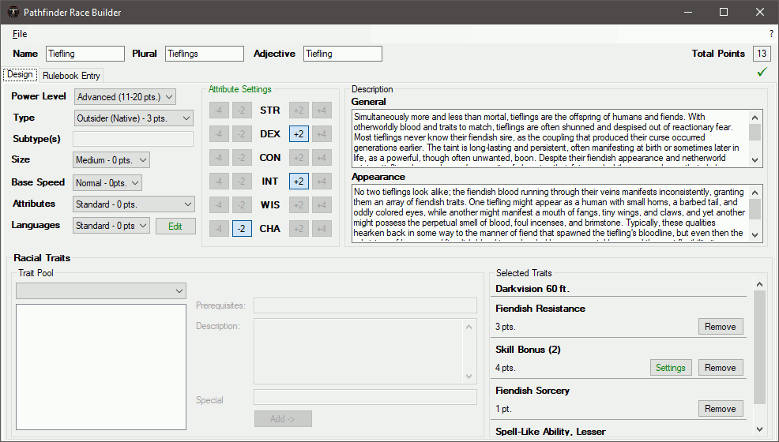

# Pathfinder Race Builder

A C# based builder for custom races in the Pathfinder tabletop system.  After making an initial functional version, my gaming group stopped playing and motivation was lost to continue on the project.  More info on Pathfinder can be found in its [system resource document](https://www.d20pfsrdcom/).

There are 3 subfolders included here:

## PathfinderSystem

Defines general rules and statistics for the Pathfinder tabletop system.  This is designed to be generic and reusable, as I originally had intentions of making a character creator as well.  A little work has been done on implementing character classes in support of this.

## PathfinderRaceBuilder

Unsurprisingly, the code for the race builder program itself.  It's a Winforms application that loads PathfinderSystem as a DLL.

## PathfinderSpellDBParser

A development tool for converting the [spell database](https://www.d20pfsrd.com/magic/tools/spells-db/) from the SRD site into the XML format used by **PathfinderSystem**.  This requires the spell DB in a TSV (tab-separated value) file in the same directory.  After parsing, values for the `<Quality>` node on each spell need to be set manually as descriptors for the program to use.